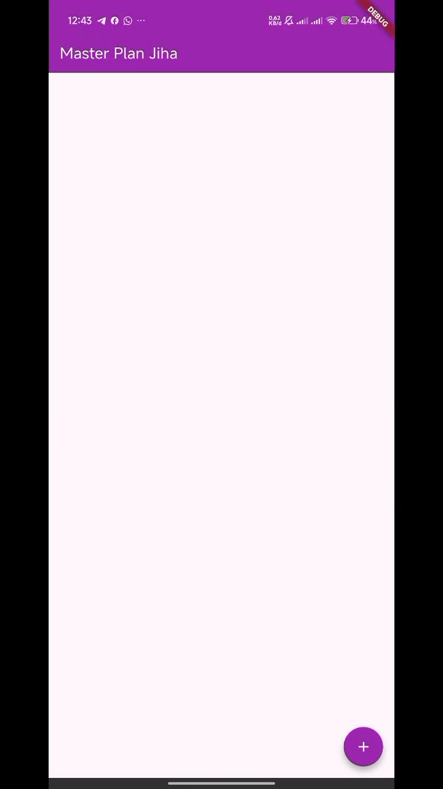
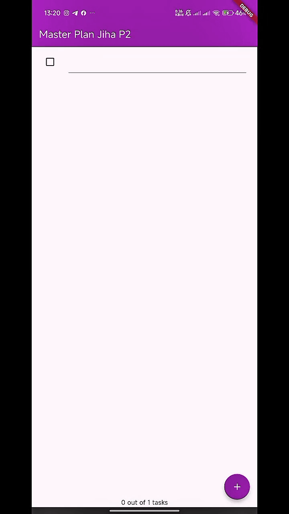
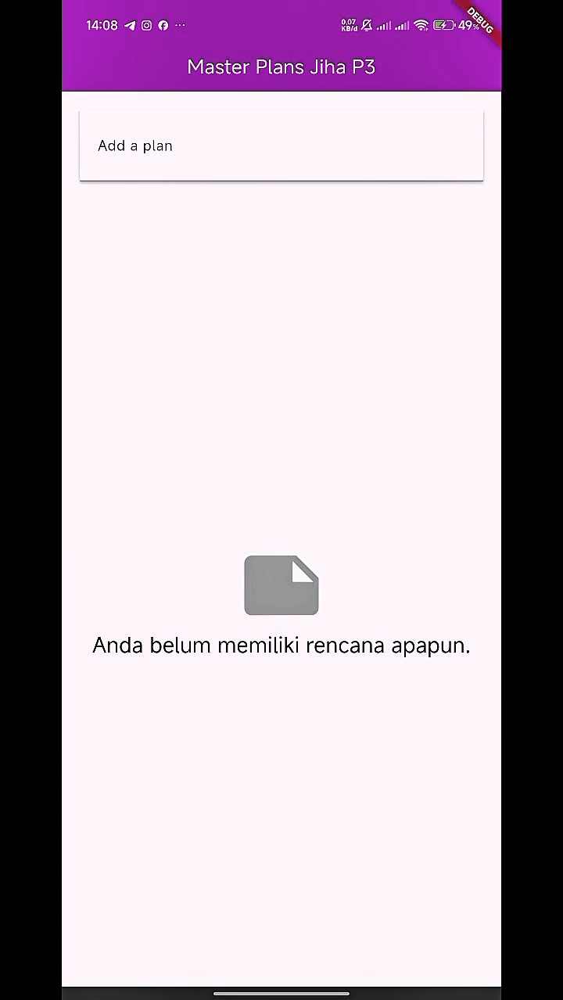

# 📝 Master Plan – Praktikum 1, 2, dan 3  
**Jiha Ramdhan / 16 / TI-3D / 2341720043**

---

## 📌 Praktikum 1 — Dasar State dengan Model–View

### **2. Langkah 4 — `data_layer.dart`**
File `data_layer.dart` berfungsi sebagai *barrel file*:

- Mengekspor `plan.dart` dan `task.dart`.
- Memudahkan impor model hanya dengan:
  ```dart
  import 'models/data_layer.dart';
  ```
- Mengurangi repetisi impor dan meningkatkan maintainability saat jumlah model semakin banyak.
- Menyembunyikan struktur folder sehingga lebih mudah saat refactor.

---

### **3. Variabel `plan` di Langkah 6 dan alasan `const`**

**Kenapa ada variabel `plan`?**
- Menyimpan state utama aplikasi (list task, status complete) sebagai *single source of truth*.
- Memudahkan sinkronisasi UI ketika task berubah.

**Kenapa `const`?**
- `const Plan()` digunakan untuk membuat state awal bersifat **immutable**.
- Mengurangi alokasi objek tidak perlu (canonicalization).
- Memastikan perubahan state hanya lewat mekanisme resmi (setState/ValueNotifier).

---

### **4. Hasil Langkah 9**
GIF hasil praktikum: <br>



**Penjelasan:**
- `ListTile` berisi Checkbox dan TextFormField.
- Ketika user mengetik atau mencentang task, state diperbarui dengan:
  ```dart
  List<Task>.from(plan.tasks)
    ..[index] = Task(description: text, complete: task.complete);
  ```
- UI otomatis rebuild → task dapat diedit, dicentang, dan progress ikut berubah.

---

### **5. Penjelasan `initState()` dan `dispose()`**

**`initState()`**
- Menyiapkan resource pertama kali widget dibuat.
- Contoh: inisialisasi `ScrollController` + tambah listener untuk unfocus TextField saat scroll.

**`dispose()`**
- Membersihkan resource yang digunakan widget.
- Contoh: `scrollController.dispose()` untuk mencegah memory leak.

🔎 *Intinya:*  
`initState()` = setup awal → `dispose()` = cleanup akhir.

---

## 📌 Praktikum 2 — InheritedWidget & InheritedNotifier

### **2. Mana InheritedWidget yang dimaksud dan kenapa memilih `InheritedNotifier`?**

Kode menggunakan:

```dart
class PlanProvider extends InheritedNotifier<ValueNotifier<Plan>>
```

Artinya:

- Widget ini adalah **InheritedWidget** yang membagikan state `Plan` ke seluruh subtree.
- Menggunakan **InheritedNotifier + ValueNotifier** memberikan:
  - Rebuild otomatis saat nilai berubah.
  - Tidak perlu override `updateShouldNotify`.
  - Lebih ringan dan lebih praktis untuk kasus yang reaktif.

---

### **3. Penjelasan method di langkah 3**

```dart
int get completedCount => tasks.where((t) => t.complete).length;

String get completenessMessage => '$completedCount out of ${tasks.length} tasks';
```

Tujuan:

- Logika dihitung di **model**, bukan UI.
- UI cukup memanggil:  
  ```dart
  plan.completenessMessage
  ```
- Menerapkan prinsip **Thin UI, Fat Model**.

---

### **4. Hasil Langkah 9 (GIF + Penjelasan)**




Penjelasan:

- Menggunakan `ValueListenableBuilder<Plan>` agar UI update otomatis saat plan berubah.
- Progress tampil di footer (`SafeArea`).
- Struktur:  
  - `Column` → membungkus layout  
  - `Expanded` → agar ListView tidak menggeser footer  
- Interaksi pada GIF: menambah task, mengedit task, mencentang task → semua update real-time.

---

## 📌 Praktikum 3 — Multiple Screens & Shared State

### **2. Penjelasan Diagram**


Diagram menggambarkan transisi dari **single screen** menjadi **multiple screens**.

**Bagian kiri — sebelum penerapan:**
- Semua widget (Input, ListView, Checkbox, dsb.) berada di **satu halaman**.
- User belum bisa membuka halaman detail plan.

**Bagian kanan — sesudah penerapan:**
- Ada dua screen:
  1. **PlanCreatorScreen** → daftar rencana
  2. **PlanScreen** → halaman detail (task lengkap)
- Data plan dibawa ke halaman baru dan tetap sinkron berkat InheritedNotifier.

Intinya: aplikasi dipisah menjadi dua layar agar UX lebih terstruktur dan lebih mudah mengelola state di banyak halaman.

---

### **3. Hasil Langkah 14 (GIF + penjelasan)**




**Penjelasan:**  
Pada langkah ini saya telah:

- Membuat *Plan List Screen* untuk memilih plan.
- Menekan salah satu plan membuka **PlanScreen** baru.
- Halaman PlanScreen menampilkan:
  - Daftar task  
  - Checkbox  
  - TextField  
  - Tombol tambah task  
  - Progress: “x out of y tasks”

State tetap konsisten meskipun berpindah halaman karena Plan disimpan dengan **ValueNotifier + InheritedNotifier**.


