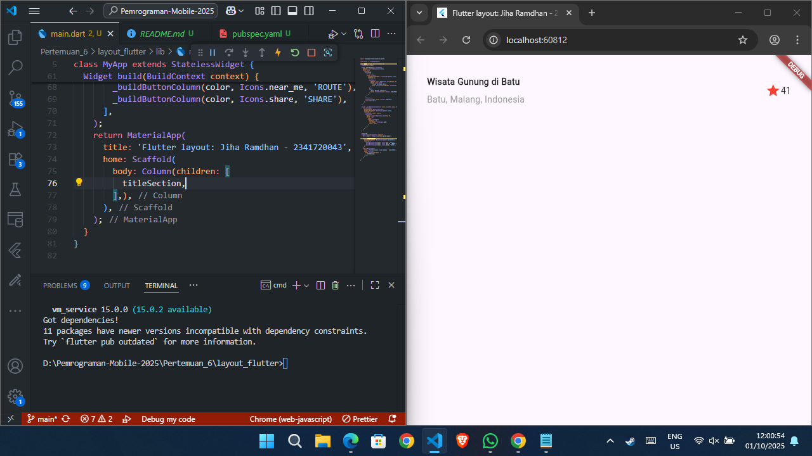
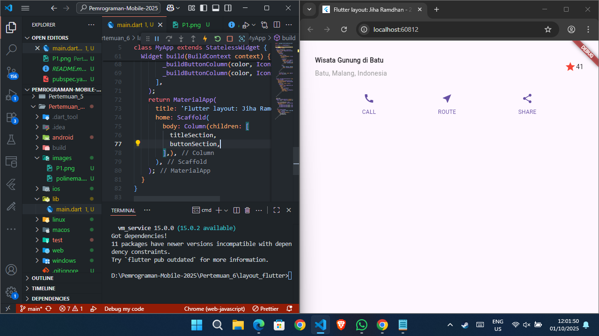
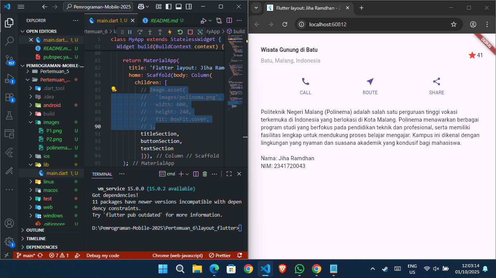
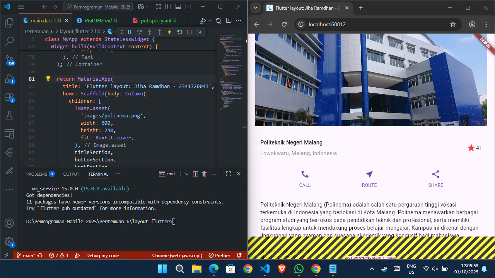
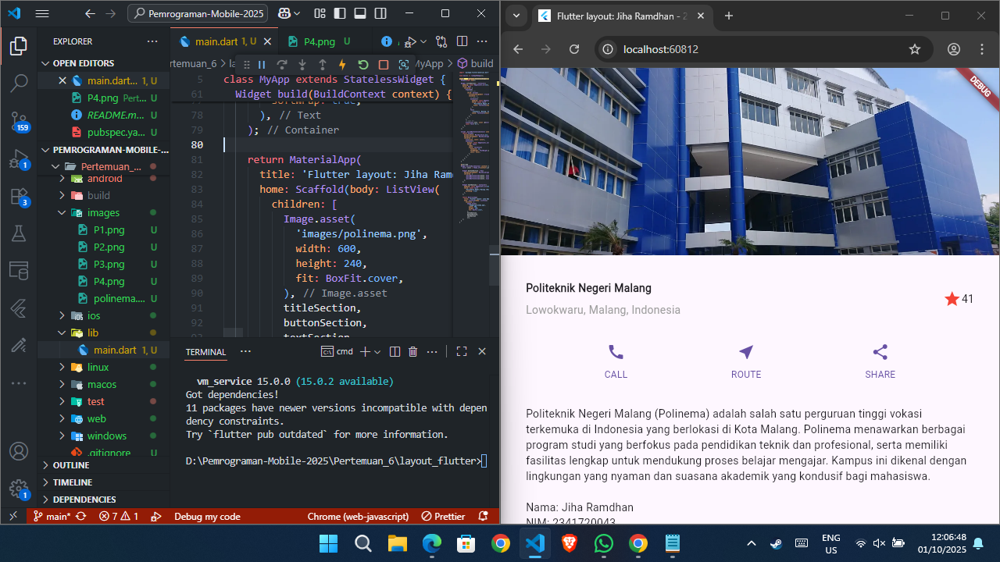
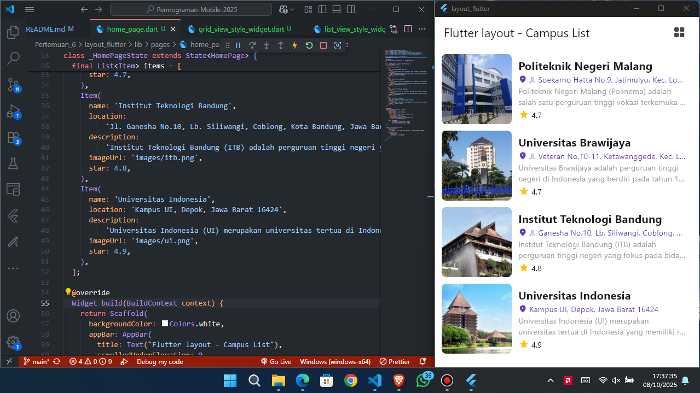
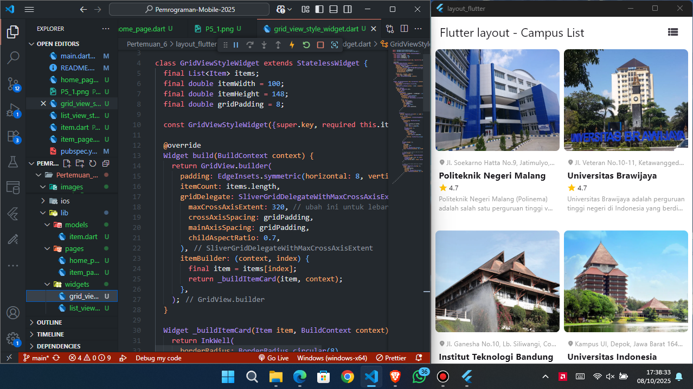
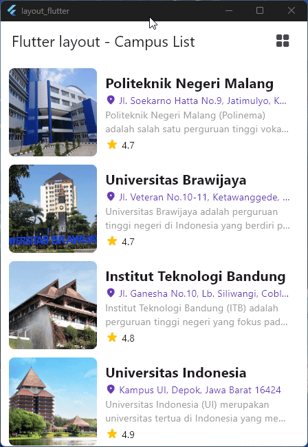

# Laporan: Layout Flutter

## Pendahuluan

Laporan ini membahas hasil implementasi layout pada aplikasi Flutter. Setiap tahap didokumentasikan dengan screenshot dari:
1. **Tugas Praktikum 1** yaitu Praktikum 1 hingga Praktikum 4. 
2. kemudian di lanjut **Tugas Praktikum 2** yaitu praktikum 5 dan tambahan

## Tugas Praktikum 1

### Praktikum 1: Membangun Layout di Flutter

> Pada praktikum ini dibuat project layout_flutter dan layout bagian title section menggunakan widget Row, Column, dan Container.
Tampilan berisi teks “Wisata Gunung di Batu”, “Batu, Malang, Indonesia”, serta ikon bintang merah dan angka 41.

### Praktikum 2: Implementasi button row

> Pada praktikum ini dibuat tiga tombol ikon (CALL, ROUTE, SHARE) yang ditampilkan secara horizontal menggunakan Row.
Setiap tombol dibangun dengan fungsi _buildButtonColumn() yang berisi ikon dan teks berwarna utama (primary color).
Tata letak diatur dengan MainAxisAlignment.spaceEvenly agar jarak antar tombol merata.
Hasilnya, ketiga ikon tampil sejajar dan responsif di bawah title section.

### Praktikum 3: Implementasi text section

> Pada praktikum ini ditambahkan text section di bawah tombol menggunakan widget Container dengan padding: EdgeInsets.all(32).
Bagian ini menampilkan teks deskriptif tentang Politeknik Negeri Malang, serta identitas nama dan NIM.
Properti softWrap: true digunakan agar teks otomatis menyesuaikan lebar layar dan membungkus dengan rapi.

### Praktikum 4: Implementasi image section - Column

> Pada tahap ini ditambahkan image section di bagian atas layout menggunakan widget Image.asset.
Properti fit: BoxFit.cover digunakan agar gambar menutupi seluruh lebar layar dengan proporsi yang rapi.
Layout masih menggunakan Column, sehingga tampilan belum bisa di-scroll.

### Praktikum 4: Implementasi image section - ListView

> Pada versi ini, struktur layout diubah dari Column menjadi ListView agar konten dapat di-scroll pada layar kecil.
Semua elemen seperti gambar, title section, button section, dan text section dimasukkan dalam satu ListView.
Hasilnya tampilan menjadi lebih responsif dan mendukung berbagai ukuran layar.

## Tugas Praktikum 2

> Lanjutan dari project layout_flutter

### Praktikum 5: Membangun Navigasi di Flutter
- List View

> 
- Grid View

> 
- Hero Widget

> 