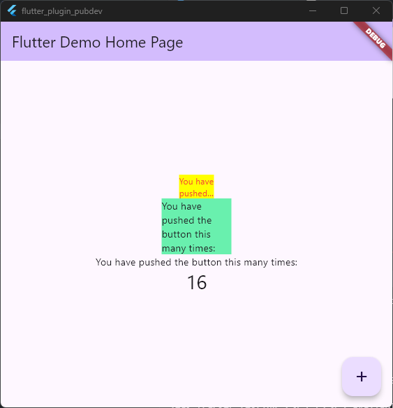

# Laporan: Manajemen Plugin

Jiha Ramdhan / 16 / 2341720043 / TI-3D

## Pendahuluan

> Laporan ini membahas hasil implementasi plugin pada aplikasi Flutter.

Berikut Hasil dari Langkah-langkah pada modul yang sudah dilakukan:



### **Jawaban Pertanyaan di langkah 4**
```dart
import 'package:auto_size_text/auto_size_text.dart'; 
```

> Adapun Kendala Error pada langkah 4 dikarenakan plugin auto_size_text itu belum diimport, lalu variable text belum dideklarasikan, yang nantinya akan dibuat pada langkah ke 5

## Jawaban Pertanyaan Tugas Praktikum
2. Jelaskan maksud dari langkah 2 pada praktikum tersebut!
    > Langkah ini menambahkan plugin eksternal dari pub.dev ke proyek Flutter. Perintah flutter pub add auto_size_text akan:

        - Menginstal plugin dari repository pub.dev.
        - Menambahkannya ke pubspec.yaml.
        - Plugin digunakan untuk menyesuaikan ukuran teks otomatis agar muat di wadah.

3. Jelaskan maksud dari langkah 5 pada praktikum tersebut!
    > Langkah ini menambahkan variabel dan parameter konstruktor:

    ```dart
    final String text;
    const RedTextWidget({Key? key, required this.text}) : super(key: key);
    ```

    Fungsi:

    - ``final String text;`` menyimpan teks yang ditampilkan.
    - ``required this.text`` memastikan nilai teks wajib diisi saat widget dibuat. Tanpa ini, AutoSizeText tidak tahu teks apa yang akan ditampilkan.


4. Pada langkah 6 terdapat dua widget yang ditambahkan, jelaskan fungsi dan perbedaannya!
    ```dart
    Container(
        color: Colors.yellowAccent,
        width: 50,
        child: const RedTextWidget(
            text: 'You have pushed the button this many times:',
        ),
    ),
    Container(
        color: Colors.greenAccent,
        width: 100,
        child: const Text(
            'You have pushed the button this many times:',
        ),
    ),
    ```

    **Perbedaan dari dua Container di atas:**

    - `RedTextWidget` (dalam Container kuning, lebar 50) menggunakan plugin `auto_size_text` sehingga teks akan otomatis menyesuaikan ukuran agar muat di wadah yang sempit.
    - `Text` (dalam Container hijau, lebar 100) adalah widget standar Flutter, teks tidak otomatis menyesuaikan ukuran dan bisa terpotong jika wadah terlalu kecil.
    - Warna latar dan lebar Container juga berbeda, sehingga hasil tampilan dan penyesuaian teks akan berbeda.

5. Jelaskan maksud dari tiap parameter yang ada di dalam plugin auto_size_text berdasarkan tautan pada dokumentasi ([ini](https://pub.dev/documentation/auto_size_text/latest/))!

| Parameter            | Deskripsi                                                                                                   |
|----------------------|-------------------------------------------------------------------------------------------------------------|
| `key`*               | Mengontrol bagaimana satu widget menggantikan widget lain dalam pohon widget.                              |
| `textKey`            | Menetapkan key untuk widget Text yang dihasilkan.                                                          |
| `style`*             | Jika tidak null, digunakan sebagai gaya teks.                                                              |
| `minFontSize`        | Batas ukuran font minimum saat penyesuaian otomatis. Diabaikan jika presetFontSizes diatur.                |
| `maxFontSize`        | Batas ukuran font maksimum saat penyesuaian otomatis. Diabaikan jika presetFontSizes diatur.               |
| `stepGranularity`    | Besaran langkah perubahan ukuran font saat penyesuaian.                                                    |
| `presetFontSizes`    | Daftar ukuran font yang sudah ditentukan. Harus urut menurun.                                              |
| `group`              | Menyinkronkan ukuran beberapa AutoSizeText sekaligus.                                                      |
| `textAlign`*         | Mengatur perataan horizontal teks.                                                                         |
| `textDirection`*      | Mengatur arah penulisan teks, mempengaruhi interpretasi textAlign.                                         |
| `locale`*             | Digunakan untuk memilih font jika karakter Unicode bisa berbeda tergantung lokal.                           |
| `softWrap`*           | Menentukan apakah teks boleh dipotong di line break lunak.                                                 |
| `wrapWords`          | Menentukan apakah kata yang tidak muat di satu baris akan dibungkus. Default true seperti widget Text.     |
| `overflow`*           | Mengatur bagaimana overflow visual ditangani.                                                              |
| `overflowReplacement`| Jika teks meluap dan tidak muat, widget ini akan ditampilkan sebagai pengganti.                            |
| `textScaleFactor`*    | Jumlah piksel font untuk setiap piksel logis. Mempengaruhi minFontSize, maxFontSize, dan presetFontSizes.  |
| `maxLines`           | Jumlah maksimum baris yang dapat digunakan oleh teks.                                                      |
| `semanticsLabel`*     | Label alternatif untuk kebutuhan aksesibilitas.                                                            |

**Catatan:** Parameter yang diberi tanda * berfungsi sama seperti pada widget Text standar Flutter.