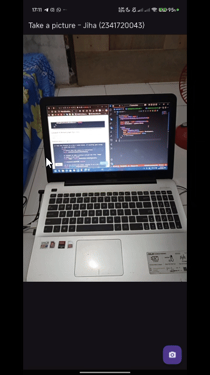
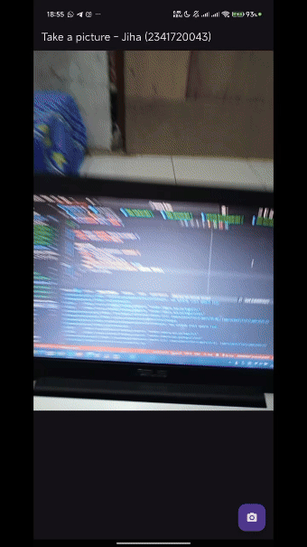

# Laporan: Kamera Flutter

Jiha Ramdhan / 16 / 2341720043 / TI-3D

> [!WARNING]
> Mohon ditunggu... pemuatan GIF mungkin memerlukan waktu tergantung pada kecepatan koneksi internet.

## Praktikum 1 - Mengambil Foto dengan Kamera di Flutter
 
> Pada praktikum ini saya membuat aplikasi Flutter yang bisa membuka kamera, menampilkan preview, mengambil foto, lalu menampilkan hasil foto tersebut pada halaman baru.

## Praktikum 2 - Membuat Photo Filter Carousel
 
> Disini saya sekalian melanjutkan Praktikum yang sebelumnya dengan menambahkan fitur "Apply Filter", sekaligus menjawab pertanyaan nomor 2 pada Tugas Praktikum.

## Soal Tambahan
### 3. Jelaskan maksud `void async` pada praktikum 1?
`async` dipakai supaya fungsi bisa jalan secara asynchronous dan bisa pakai `await`.
Kalau kita pakai `Future<void>` itu lebih tepat, karena fungsi bisa ditunggu hasilnya `(await)`.
Kalau tetap `void async`, sebenarnya tetap bisa pakai `await` di dalamnya, tapi fungsi itu tidak bisa di-`await` dari luar, jadi tidak ideal.

### 4. Jelaskan fungsi dari anotasi `@immutable` dan `@override`?
- `@immutable` → menandakan class itu tidak boleh berubah isinya (property harus `final`). Biasanya dipakai pada widget biar konsisten dan aman.
- `@override` → untuk menandai bahwa method tersebut sedang menimpa method yang sama dari parent class. Biar jelas dan kalau salah penulisan compiler bisa mendeteksi.

